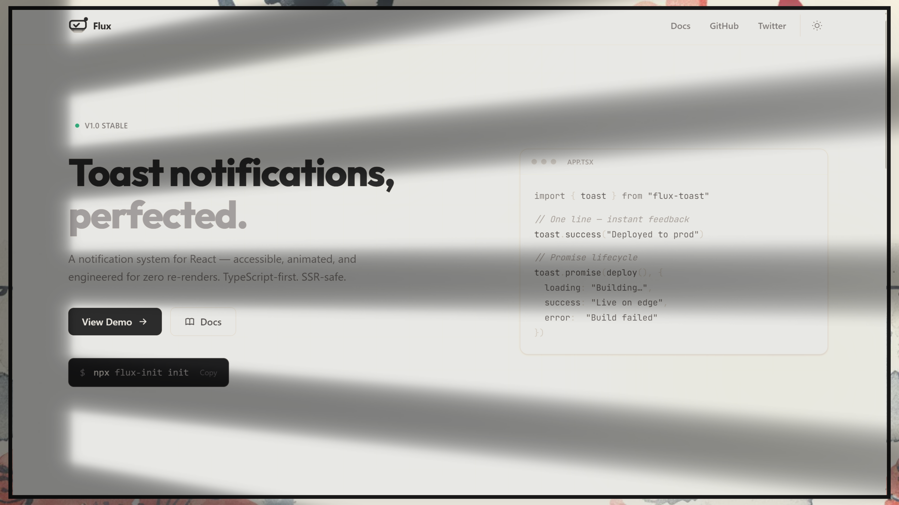

# Flux 🌊

**Beautiful, accessible, and performant toast notifications for React.**

Flux is a notification system designed for modern web applications. It provides a premium experience with advanced animations, zero-knowledge setup, and a developer-friendly API.

[View Documentation](https://flux.heyyswap.in/docs) · [View Demo](https://flux.heyyswap.in/#demo)



## Core Features

- **✨ Pure Performance:** Engineered for zero unnecessary re-renders using Zustand.
- **🛡️ Accessible:** ARIA-compliant, keyboard navigable, and respects reduced motion.
- **🚀 SSR-Safe:** Works flawlessly with Next.js (App & Client boundaries).
- **🎨 Glassmorphism:** Sleek, modern design with advanced blur and backdrops.
- **⚡ Interactive:** Swipe to dismiss, pause on hover, and lifecycle callbacks.

## Project Structure

This repository contains:

- `app/`: The official documentation and landing page.
- `src/flux-toast/`: The core library source code.
- `src/flux-cli/`: The `flux-init` CLI tool for rapid setup.

## Getting Started

The easiest way to integrate Flux into your project is using our CLI:

```bash
npx flux-init init
```

For manual installation:

```bash
npm install flux-toast motion zustand
```

## Basic Usage

```tsx
"use client";
import { toast } from "flux-toast";

function App() {
  return (
    <button onClick={() => toast.success("It just works!")}>
      Show Success
    </button>
  );
}
```

## Contributing

We welcome contributions! Please see our [GitHub Repo](https://github.com/Codewithswappy/flux-toast) for issue tracking.

## License

MIT © [Codewithswappy](https://github.com/Codewithswappy)
